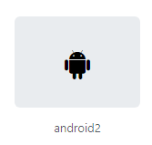

# Bootstrap Icons

A biblioteca de ícones do Bootstrap 5, chamada de **Bootstrap Icons**, oferece um conjunto de ícones prontos para uso que podem ser facilmente integrados aos seus projetos web. Atualmente conta com mais de 1800 ícones!

Existem diferentes opções para integrar a biblioteca de ícones em um projeto, e para todas elas, é necessário acessar a **àrea de instalação em sua página inicial**:

Você pode instalar a biblioteca de duas maneiras:

- Baixando os arquivos manualmente do site do Bootstrap;
- Baixar através de um gerenciador de pacotes, como npm.

Você também pode importar a biblioteca para utilizar seus ícones, sem a necessidade de download, de duas maneiras:

- Adicionando o link CDN na tag head do arquivo HTML. Essa foi a forma que já integramos a biblioteca de ícones na atividade “Preparando o ambiente”;
- Adicionando import CDN no arquivo CSS.

### Como inserir ícones no projeto?

Com a biblioteca Bootstrap Icons integrada ao projeto, é preciso apenas escolher um ícone disponível na biblioteca, copiar o seu código, e colar no projeto. Como por exemplo o ícone: `<i class="bi bi-android2"></i>`.

### [Voltar ao README](../README.md)