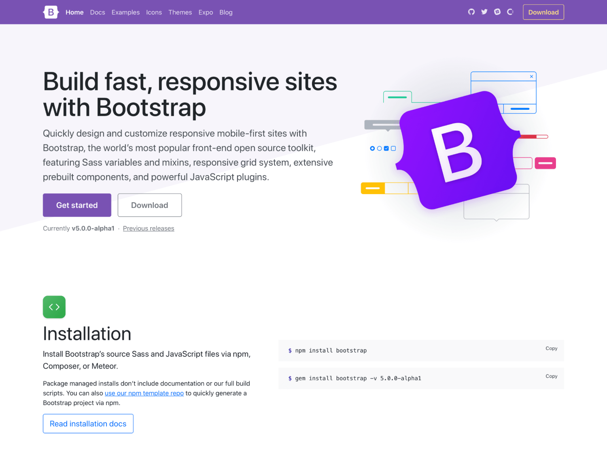
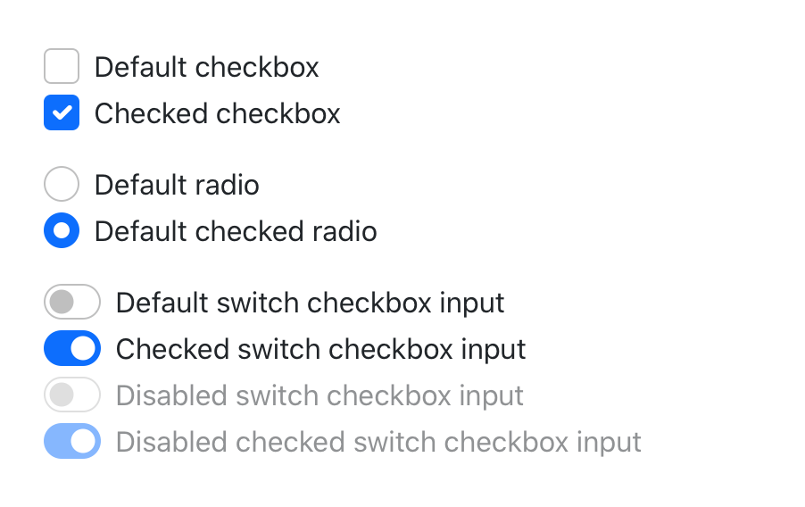
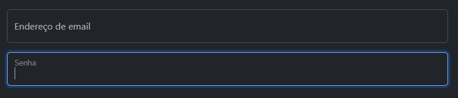
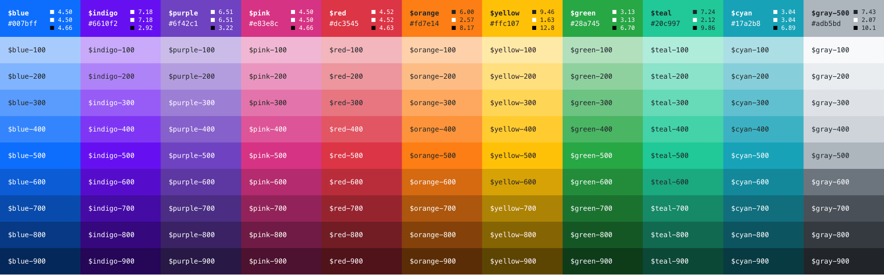

# Hello Bootstrap 5.3.0-alpha1

Depois de um longo tempo de espera pela comunidade, saiu a nova versão do Bootstrap! Esse framework de CSS que é o mais popular do mundo e um dos mais inovadores.

Quer saber quais são as principais novidades?

Confira abaixo as 7 principais mudanças que a versão 5 nos trouxe!

## 1. Adeus JQuery!

Talvez essa seja a maior das novidades! Depois de tantos anos de parceria, o Bootstrap não depende mais do jQuery! Agora o seu uso é feito por meio do JavaScript puro (Vanilla) e o ponto positivo da mudança, é que a biblioteca fica mais enxuta, com isso os projetos são significativamente mais leves em tamanho e o tempo de carregamento das páginas diminui.

## 2. Documentação está de cara nova

O layout da doc foi todo revisado e atualizado com uma nova aparência para otimizar a visibilidade e legibilidade. Agora, o conteúdo não está com a largura total da página, o tornando mais semelhante à uma página,ao invés de um aplicativo. A barra lateral de seções expansíveis foi atualizada para uma navegação mais rápida. Um novo logotipo foi construído e inspirado no CSS. E além de tudo disso, houveram diversos aprimoramentos em relação ao conteúdo, com aumento das explicações dando maior suporte para entender a ferramenta e também remoção de ambiguidades nos textos.

## 3. Fim do suporte ao Internet Explorer

O suporte a esse navegador foi banido na versão 5! A equipe do Bootstrap deixou claro que o foco da atualização é o uso de ferramentas mais compatíveis com o contexto atual e futuro e o principal motivo é a falta de suporte a propriedades novas do CSS e aos padrões modernos de JavaScript, fazendo com que os códigos precisassem ser compilados no ES5 em vez do ES6.

## 4. Formulários incríveis!

Os componentes do forms foram totalmente redesenhados, cada caixa de seleção, rádio, arquivo, intervalo e muito mais incluem uma aparência personalizada para unificar o estilo e trazer um comportamento nos controles mais consistente para os navegadores e sistema operacional.

Uma novidade interessante, é que ficou ainda mais fácil a criação de labels flutuantes. Basta adicionar na tag input a classe `form-floating` que a mágica vai acontecer!

## 5. Customize ainda mais!

Na versão anterior, o Bootstrap já era bastante personalizável e extensível, mas agora existem ainda mais suportes de personalização através das variáveis do SASS e mixins.

A paleta de cores também foi expandida, fornecendo ampla variedade para personalizar mais facilmente a aparência do seu projeto, com melhoria no contraste de cores também.

Com a eliminação do suporte ao Internet Explorer, começou a se usar propriedades personalizadas de uma forma menos restrita, às variáveis de CSS que antes eram utilizadas para cores e fontes, agora estão sendo aplicadas a alguns componentes e opções de layout também.

## 6. offcanvas: um novo componente para ser explorado!

Muito parecido com um modal, é um componente que atua como uma barra lateral que fica ocultada até o momento em que é disparada e surge na tela posicionada na borda esquerda, borda direita ou borda inferior. Pode ser utilizada para construir um carrinho de compras, por exemplo.

## 7. Utilitários com super poderes

O Bootstrap já tem uma fama consolidada em relação a quantidade de utilitários disponíveis para uso, mas nessa versão conseguiram evoluir ainda mais a sua maneira de ofertá-los.

Na v5, os utilitários são gerados com um API, que permite a modificação ou extensão do conjunto padrão de classes de utilitários. Essa API utilitária é baseada em mapas e funções Sass para gerar famílias de classes com diversas opções, aumentando ainda mais as possibilidades de construção.

### [Voltar ao README](../README.md)