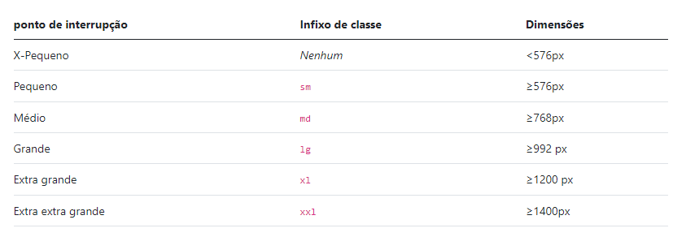

# Breakpoints do Bootstrap

Como conversamos no vídeo anterior, os breakpoints ou pontos de quebra são abreviações que ficam no meio da classe utilitária e representam determinadas larguras da tela. Os breakpoints são grandes aliados na hora de lidar com a responsividade de diferentes dispositivos e tamanhos de viewport, por meio deles é possível trazer configurações específicas para as telas.

## sm, md, lg, xl e xxl

Na tabela abaixo, você pode conferir os seis pontos de quebra que são padrões do Bootstrap 5 , que também são chamados de níveis de grid.

O interessante é que, propositalmente, os pontos foram idealizados para acomodar caixas com larguras múltiplas de 12, onde esses intervalos fornecem de forma consistente a construção de praticamente qualquer dispositivo.

## Mas, e a personalização?

Caso deseje valores diferentes da tabela para as dimensões da tela, não se preocupe! O Bootstrap agiliza o trabalho da pessoa desenvolvedora, mas também é bem flexível para você fazer à sua maneira.

Esses valores são facilmente personalizáveis graças a grande conexão do Bootstrap com o pré-processador Sass.

### [Voltar ao README](../README.md)