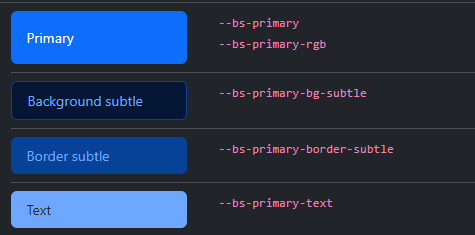

# Temas de Cores no Bootstrap 5

Um dos grandes pontos positivos que tornam o Bootstrap popular, é o seu sistema de cores. Sua paleta contém uma alta variedade de tonalidades que se expandiram ainda mais com a versão 5.

Por meio das **variáveis** Sass e CSS, você pode fazer uso de **temas** para te auxiliar na estilização do seu projeto. Abaixo, há o conjunto de cores **Primary** que é indicado para uso como cor do tema principal, em hiperlinks, estilos de foco e estados ativos de componentes e formulários.



O interessante, é que você já consegue aplicar cores específicas para os textos, cor de fundo, bordas, links e muito mais dentro de um mesmo tema.

Essas novas cores da versão 5 são acessíveis não só pelas variáveis ​​CSS, mas também pelas **classes utilitárias**, como por exemplo `.bg-primary-subtle`.

Existem diversos outros temas disponíveis, que são destinados a criação de uma paleta diversa para informações positivas, erros, avisos, modo escuro, modo claro e etc. Visualize a seguir no codepen, um componente de botão sendo estilizado com temas de cores do Bootstrap 5, em seu estado padrão e no `hover`.

```
<h2 class="text-center mt-5 mb-3">Temas para Botões no Bootstrap 5</h2>
<div class="d-flex justify-content-center gap-2">
  <button type="button" class="btn btn-default border-dark-subtle">Padrão</button>
  <button type="button" class="btn btn-primary">Primário</button>
  <button type="button" class="btn btn-success">Sucesso</button>
  <button type="button" class="btn btn-info">Informação</button>
  <button type="button" class="btn btn-warning">Alerta</button>
  <button type="button" class="btn btn-danger">Erro</button>
  <button type="button" class="btn btn-link">Link</button>
</div>
```

### [Voltar ao README](../README.md)