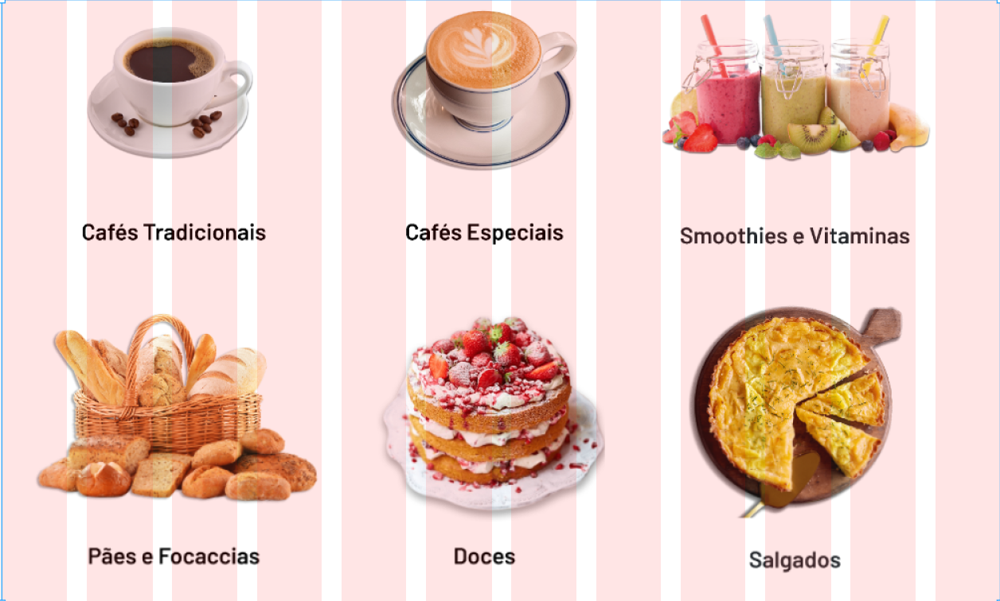
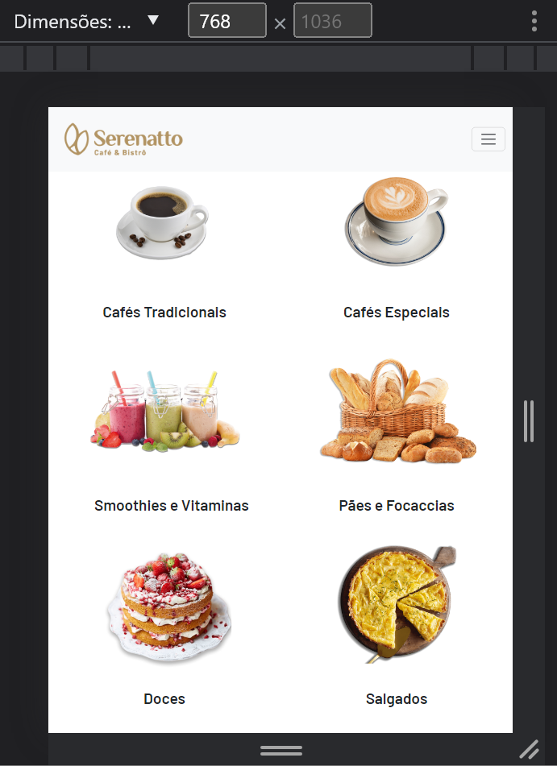

# Grid e responsividade no Bootstrap

O sistema de grid do Bootstrap é baseado em um sistema de grade flexível que usa classes para definir o layout da página em diferentes tamanhos de tela. O sistema é composto por linhas (rows) e colunas (columns), que são organizados em um grid.

O grid do Bootstrap divide a tela em 12 colunas na vertical, e é possível utilizar suas classes para definir quantas colunas um elemento irá ocupar na tela.



Código do exemplo acima, onde cada elemento ocupa três colunas:

```
<body class=”row”>
    <div class="col-3"></div>
    <div class="col-3"></div>
    <div class="col-3"></div>
    <div class="col-3"></div>
    <div class="col-3"></div>
    <div class="col-3"></div>
</body>
```

Como utilizar o grid de forma responsiva?

O Bootstrap possibilita utilizar em conjunto do grid as classes de Breakpoints, dessa forma, é possível variar quantas colunas um elemento vai ocupar no layout, de acordo com a largura da página.

Layout com 768 pixels de largura:



Layout com menos de 768 pixels de largura(700 pixels de largura):


Código do exemplo acima:

```
<body class="row">
    <div class="col-12 col-md-6"></div>
    <div class="col-12 col-md-6"></div>
    <div class="col-12 col-md-6"></div>
    <div class="col-12 col-md-6"></div>
    <div class="col-12 col-md-6"></div>
    <div class="col-12 col-md-6"></div>
</body>
```

Neste exemplo os elementos estão organizados de forma responsiva. Cada elemento ocupando inicialmente 12 colunas com a classe `col-12`. Caso o dispositivo tenha largura de 768 pixels ou maior, a organização deles será modificada. Por conta da classe `col-md-6`, cada card ocupará 6 colunas das 12 disponíveis, ficando 2 por linha.

Essa técnica de unir Grid e Breakpoints é muito utilizada para aplicar responsividade em páginas, adequando a organização de itens de acordo com o layout proposto para cada tipo de dispositivo. Vamos praticar e fixar o conhecimento adquirido? A seguir você vai encontrar um exercício e um desafio para organizar elementos da cafeteria Serenatto!

### [Voltar ao README](../README.md)