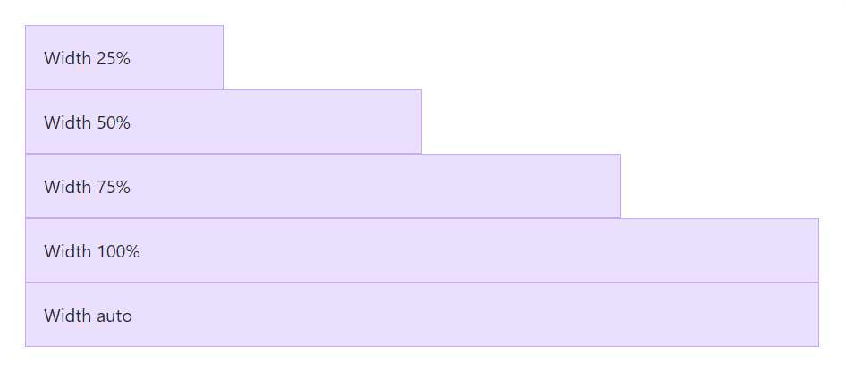
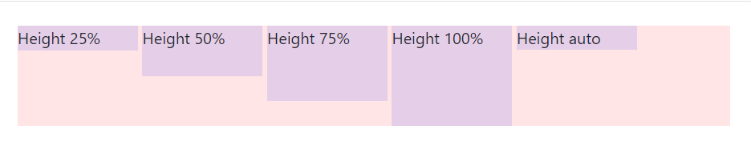

# Tamanho e largura no Bootstrap

Com Bootstrap aplicar altura e largura em algum elemento da página pode se tornar algo muito mais prático. Vamos conhecer alguns padrões que ele nos fornece?

Conferindo primeiro a largura, que com o CSS puro seria definido pelo `width`, é aplicado através da classes em porcentagem:



Código da imagem acima:

```
<div class="w-25 p-3">Width 25%</div>
<div class="w-50 p-3">Width 50%</div>
<div class="w-75 p-3">Width 75%</div>
<div class="w-100 p-3">Width 100%</div>
<div class="w-auto p-3">Width auto</div>
```

- `w-25` - referente à 25% de largura;
- `w-50` - referente à 50% de largura;
- `w-75`- referente à 75% de largura;
- `w-100` - referente à 100% de largura;
- `w-auto` - referente à largura auto.

Agora conferindo as classes do Bootstrap para definir altura `height`:



Código da imagem acima:

```
<div style="height: 100px; background-color: rgba(255,0,0,0.1);">
  <div class="h-25 d-inline-block" style="width: 120px; background-color: rgba(0,0,255,.1)">Height 25%</div>
  <div class="h-50 d-inline-block" style="width: 120px; background-color: rgba(0,0,255,.1)">Height 50%</div>
  <div class="h-75 d-inline-block" style="width: 120px; background-color: rgba(0,0,255,.1)">Height 75%</div>
  <div class="h-100 d-inline-block" style="width: 120px; background-color: rgba(0,0,255,.1)">Height 100%</div>
  <div class="h-auto d-inline-block" style="width: 120px; background-color: rgba(0,0,255,.1)">Height auto</div>
</div>
```

- `h-25` - referente à 25% de altura;
- `h-50` - referente à 50% de altura;
- `h-75` - referente à 75% de altura;
- `h-100` - referente à 100% de altura;
- `h-auto` - referente à altura auto.

Os valores que podem ser atribuídos às classes de altura e largura, `h` e `w` respectivamente, são referentes às porcentagens: 25%, 50%, 75%, 100%, com exceção de `auto`, a porcentagem utiliza como referência a altura e largura de onde o item está inserido. Apenas com Bootstrap, não é possível definir um valor exato em pixels, ou alguma outra variação de porcentagem, além dessas 4 opções disponíveis.

### [Voltar ao README](../README.md)

